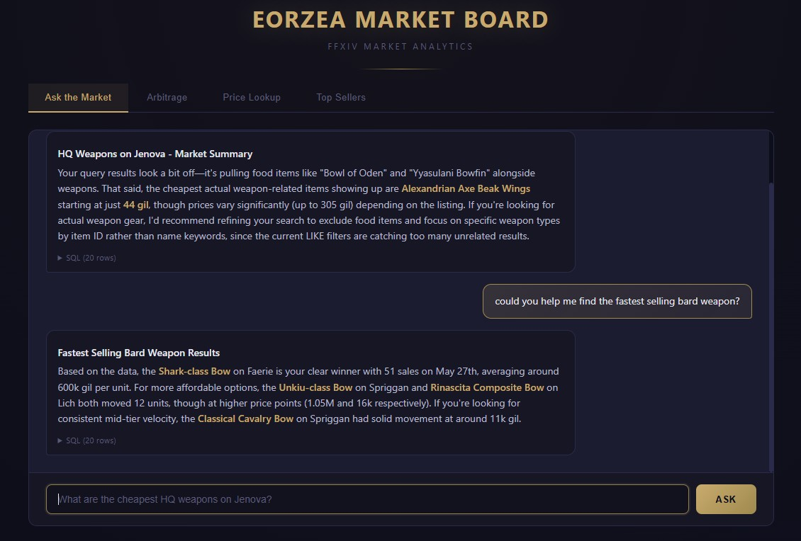
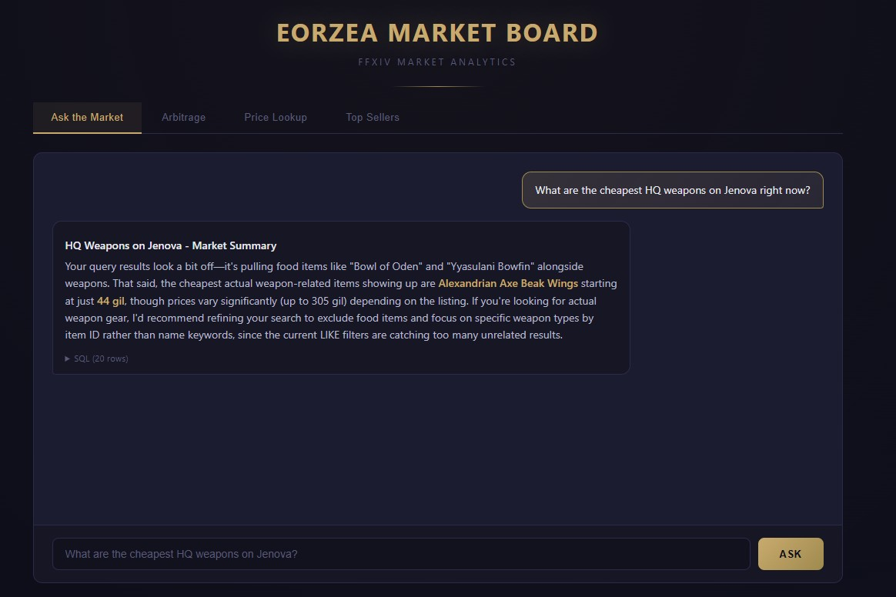
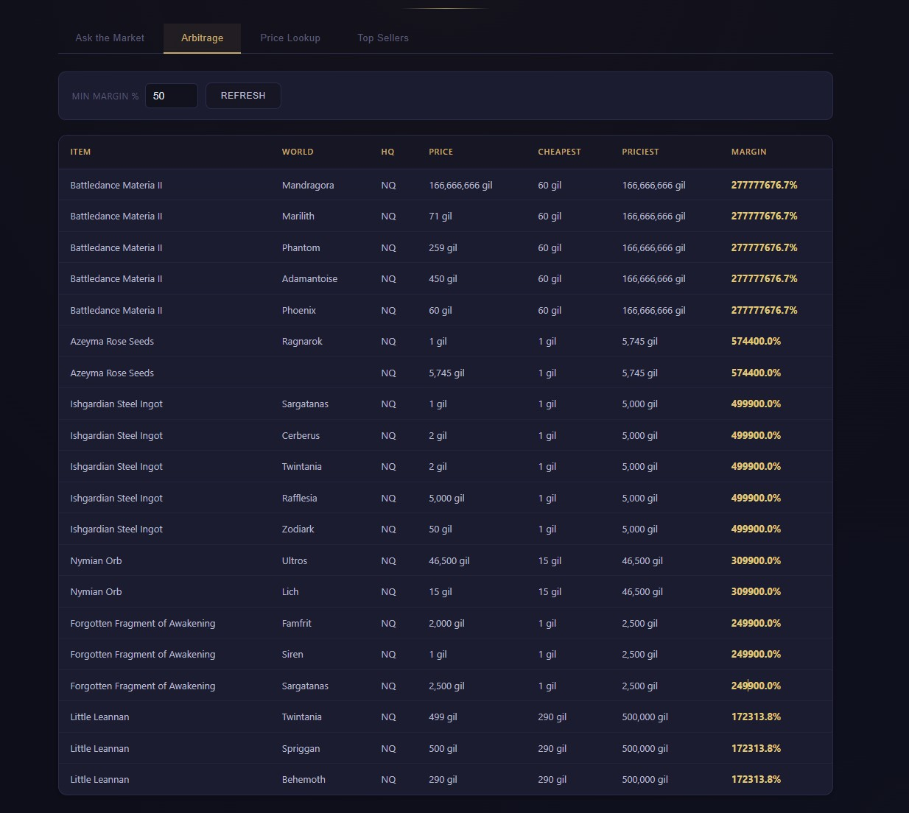
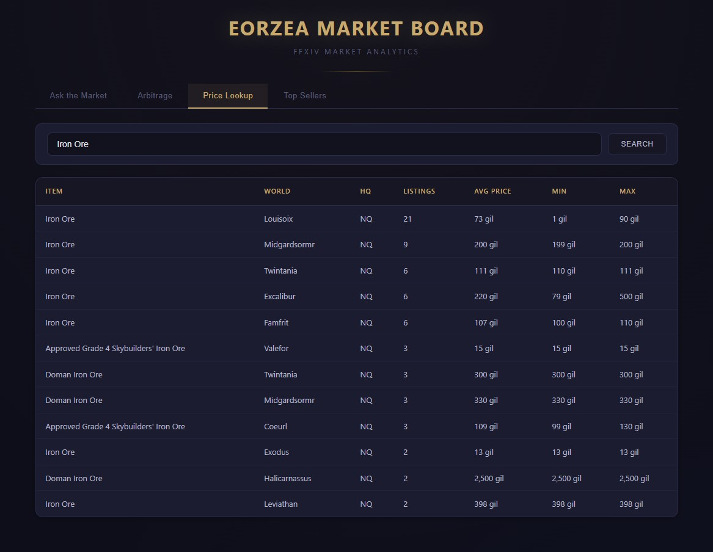
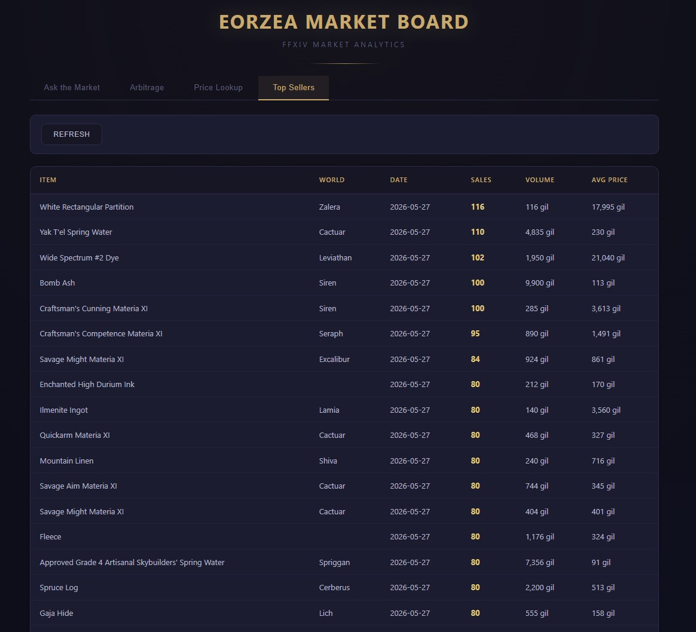
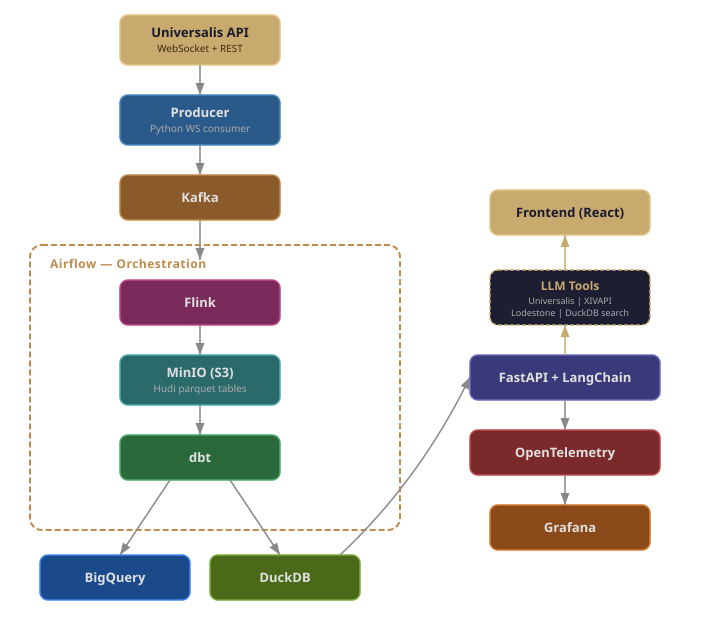
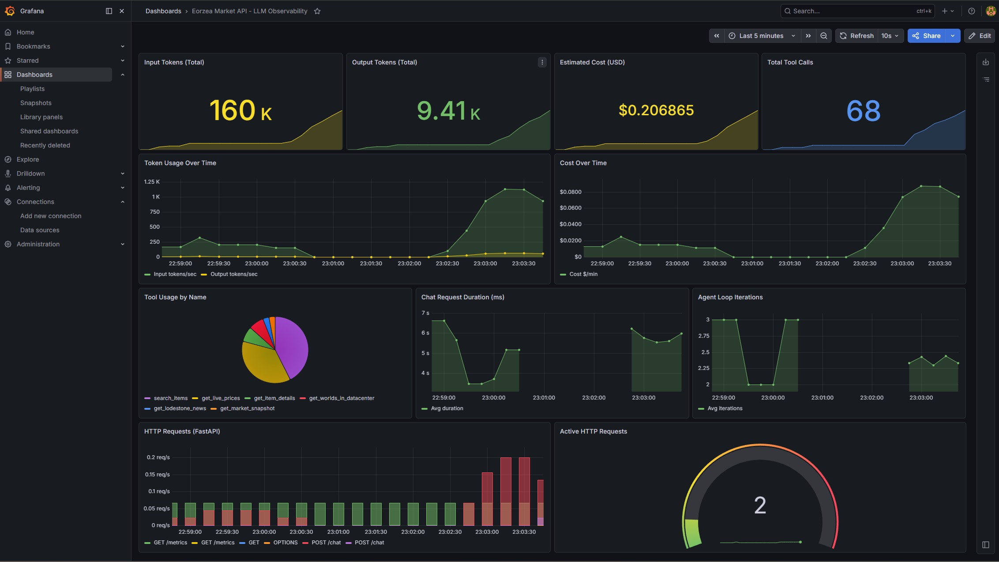

# Eorzea Marketplace Platform

An end-to-end data platform for FFXIV Market Board analytics. Ask natural language questions about prices, trends, and arbitrage opportunities through an LLM-powered agent with tool use — pulling in live data from external APIs, local warehouse queries, and web scraping.

Built on real-time data from the [Universalis API](https://universalis.app).

## App

| Chat UI | Chat with Tool Use |
|---------|-------------------|
|  |  |

| Arbitrage | Price Lookup | Top Sellers |
|-----------|-------------|-------------|
|  |  |  |

## Architecture

<p align="center">
  
</p>

## Infrastructure & Observability

| Minikube Dashboard | Grafana Dashboard |
|-------------------|-------------------|
|  |  |

## Key Features

**LLM Agent with Tool Use**
- Claude Haiku agent with 6 tools across 4 categories (local DB, game knowledge, external APIs, web scraping)
- `search_items` — fuzzy item name lookup in DuckDB
- `get_market_snapshot` — price summaries from dbt marts
- `get_worlds_in_datacenter` — FFXIV data center/world mapping
- `get_live_prices` — real-time listings from Universalis API
- `get_item_details` — item metadata from XIVAPI
- `get_lodestone_news` — latest patch notes scraped from Lodestone
- Agent loop with tool call → result → re-invoke pattern, falls back to SQL generation when needed

**Observability**
- OpenTelemetry instrumentation on the LLM agent
- Metrics: input/output tokens, estimated cost (USD), tool call frequency, request duration, agent loop iterations
- Prometheus scraping + Grafana dashboard with 11 panels

**dbt Data Quality**
- 40 tests: schema tests (not_null, unique) + singular tests with FFXIV domain logic
- No negative prices, no zero-quantity listings, arbitrage margins are positive, sale totals match price * quantity
- BigQuery target configured alongside DuckDB for cloud warehouse support

**Kubernetes**
- Helm umbrella chart with 6 subcharts (API, frontend, Kafka, MinIO, producer, Airflow)
- Official Airflow Helm chart with LocalExecutor, git-sync DAGs, built-in PostgreSQL
- KRaft-mode Kafka (no Zookeeper dependency)
- Tested on minikube

## Tech Stack

| Layer | Technology |
|-------|-----------|
| Ingestion | Python WebSocket consumer, Apache Kafka (KRaft) |
| Stream Processing | Apache Flink (Scala), Apache Hudi (MOR) |
| Storage | MinIO (S3-compatible), DuckDB, BigQuery |
| Orchestration | Apache Airflow |
| Transformation | dbt (dbt-duckdb, dbt-bigquery) |
| Serving | FastAPI, LangChain, Claude Haiku |
| Frontend | React, Vite, react-markdown |
| Observability | OpenTelemetry, Prometheus, Grafana |
| Deployment | Docker Compose, Helm, minikube |

## Repo Structure

```
├── producer/          # Universalis WebSocket → Kafka (Python)
├── flink/             # Kafka → Hudi stream processor (Scala)
├── dbt/               # dbt models: staging views + mart tables
│   └── eorzea_analytics/
│       ├── seeds/     # item_names.csv, world_names.csv
│       ├── models/    # staging + marts with schema tests
│       └── tests/     # singular data quality tests
├── airflow/           # DAGs: Flink → dbt seed → dbt run → dbt test
├── api/               # FastAPI + LangChain agent + OpenTelemetry
│   └── src/eorzea_api/
│       ├── main.py        # FastAPI app, /metrics endpoint
│       ├── chat.py        # Agent loop with tool calling
│       ├── tools.py       # 6 tools with Pydantic schemas
│       ├── telemetry.py   # OTEL metrics definitions
│       └── database.py    # DuckDB connection manager
├── front/             # React + Vite frontend (FFXIV theme)
├── helm/              # Helm umbrella chart + subcharts
│   └── eorzea-platform/
│       └── charts/    # api, frontend, kafka, minio, producer
├── infra/
│   ├── compose/       # Docker Compose (Kafka, Flink, MinIO, Airflow, Prometheus, Grafana)
│   └── grafana/       # Grafana dashboard JSON
└── docs/              # Screenshots and documentation
```

## Quick Start

**API + Frontend (local dev):**
```powershell
# Terminal 1: API
cd api
$env:ANTHROPIC_API_KEY="your-key"
$env:PYTHONPATH="src"
python -m poetry run uvicorn eorzea_api.main:app --reload --port 8000

# Terminal 2: Frontend
cd front
npx vite --host
```

**Observability:**
```powershell
docker compose -f infra/compose/docker-compose.yml up prometheus grafana -d
# Grafana: http://localhost:3000 (admin/admin)
# Metrics: http://localhost:8000/metrics
```

**Full Pipeline:**
```powershell
docker compose -f infra/compose/docker-compose.yml up -d
# Airflow: http://localhost:8080 (admin/admin)
# MinIO: http://localhost:9001 (minioadmin/minioadmin)
# Flink: http://localhost:8081
```

**Kubernetes:**
```powershell
minikube start
helm dependency update ./helm/eorzea-platform
helm install eorzea ./helm/eorzea-platform --set-string secrets.anthropicApiKey="your-key"
minikube dashboard
```
